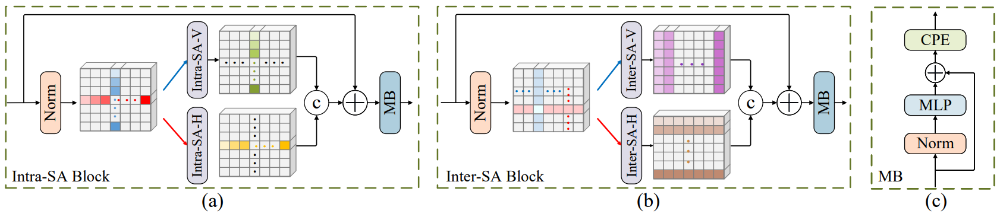

# Stripformer (ECCV 2022)
Pytorch Implementation of "[Stripformer: Strip Transformer for Fast Image Deblurring](https://arxiv.org/abs/2204.04627)" (ECCV 2022 Oral)



## Installation
The implementation is modified from "[DeblurGANv2](https://github.com/VITA-Group/DeblurGANv2)"
```
git clone https://github.com/pp00704831/Stripformer.git
cd Stripformer
conda create -n Stripformer python=3.6
source activate Stripformer
conda install pytorch==1.8.0 torchvision==0.9.0 torchaudio==0.8.0 cudatoolkit=11.1 -c pytorch -c conda-forge
pip install opencv-python tqdm pyyaml joblib glog scikit-image tensorboardX albumentations
pip install -U albumentations[imgaug]
pip install albumentations==1.1.0
```


## Training
Download "[GoPro](https://drive.google.com/drive/folders/1BdV2l7A5MRXLWszGonMxR88eV27geb_n?usp=sharing)" dataset into './datasets' </br>
For example: './datasets/GoPro'

**We train our Stripformer in two stages:** </br>
* We pre-train Stripformer for 3000 epochs with patch size 256x256 </br> 
* Run the following command 
```
python train_Stripformer_pretrained.py
```

* After 3000 epochs, we keep training Stripformer for 1000 epochs with patch size 512x512 </br>
* Run the following command 
```
python train_Stripformer_gopro.py
```

## Testing
For reproducing our results on GoPro and HIDE datasets, download "[Stripformer_gopro.pth](https://drive.google.com/drive/folders/1YcIwqlgWQw_dhy_h0fqZlnKGptq1eVjZ?usp=sharing)"

For reproducing our results on RealBlur dataset, download "[Stripformer_realblur_J.pth](https://drive.google.com/drive/folders/1YcIwqlgWQw_dhy_h0fqZlnKGptq1eVjZ?usp=sharing)" and "[Stripformer_realblur_R.pth](https://drive.google.com/drive/folders/1YcIwqlgWQw_dhy_h0fqZlnKGptq1eVjZ?usp=sharing)"

**For testing on GoPro dataset** </br>
* Download "[GoPro](https://drive.google.com/drive/folders/1BdV2l7A5MRXLWszGonMxR88eV27geb_n?usp=sharing)" full dataset or test set into './datasets' (For example: './datasets/GoPro/test') </br>
* Run the following command
```
python predict_GoPro_test_results.py --weights_path ./Stripformer_gopro.pth 
```
**For testing on HIDE dataset** </br>
* Download "[HIDE](https://drive.google.com/drive/folders/1BdV2l7A5MRXLWszGonMxR88eV27geb_n?usp=sharing)" into './datasets' </br>
* Run the following command
```
python predict_HIDE_results.py --weights_path ./Stripformer_gopro.pth 
```
**For testing on RealBlur test sets** </br>
* Download "[RealBlur_J](https://drive.google.com/drive/folders/1BdV2l7A5MRXLWszGonMxR88eV27geb_n?usp=sharing)" and "[RealBlur_R](https://drive.google.com/drive/folders/1BdV2l7A5MRXLWszGonMxR88eV27geb_n?usp=sharing)" into './datasets' </br>
* Run the following command
```
python predict_RealBlur_J_test_results.py --weights_path ./Stripformer_realblur_J.pth 
```
```
python predict_RealBlur_R_test_results.py --weights_path ./Stripformer_realblur_R.pth 
```

**For testing your own training weight (take GoPro for a example)** </br>
* Rename the path in line 23 in the predict_GoPro_test_results.py </br>
* Chage command to --weights_path ./final_Stripformer_gopro.pth

## Evaluation
* For evaluation on GoPro results in MATLAB, download "[Stripformer_GoPro_results](https://drive.google.com/drive/folders/19uXbEEHojEwC29_jL8Gkd1jknc8kiRcR?usp=sharing)" into './out'
```
evaluation_GoPro.m
```
* For evaluation on HIDE results in MATLAB, download "[Stripformer_HIDE_results](https://drive.google.com/drive/folders/19uXbEEHojEwC29_jL8Gkd1jknc8kiRcR?usp=sharing)" into './out'
```
evaluation_HIDE.m
```
* For evaluation on RealBlur_J results, download "[Stripformer_realblur_J_results](https://drive.google.com/drive/folders/19uXbEEHojEwC29_jL8Gkd1jknc8kiRcR?usp=sharing)" into './out'
```
python evaluate_RealBlur_J.py
```
* For evaluation on RealBlur_R results, download "[Stripformer_realblur_R_results](https://drive.google.com/drive/folders/19uXbEEHojEwC29_jL8Gkd1jknc8kiRcR?usp=sharing)" into './out'
```
python evaluate_RealBlur_R.py
```
## Citation
```
@inproceedings{Tsai2022Stripformer,
  author    = {Fu-Jen Tsai and Yan-Tsung Peng and Yen-Yu Lin and Chung-Chi Tsai and Chia-Wen Lin},
  title     = {Stripformer: Strip Transformer for Fast Image Deblurring},
  booktitle = {ECCV},
  year      = {2022}
}
```
